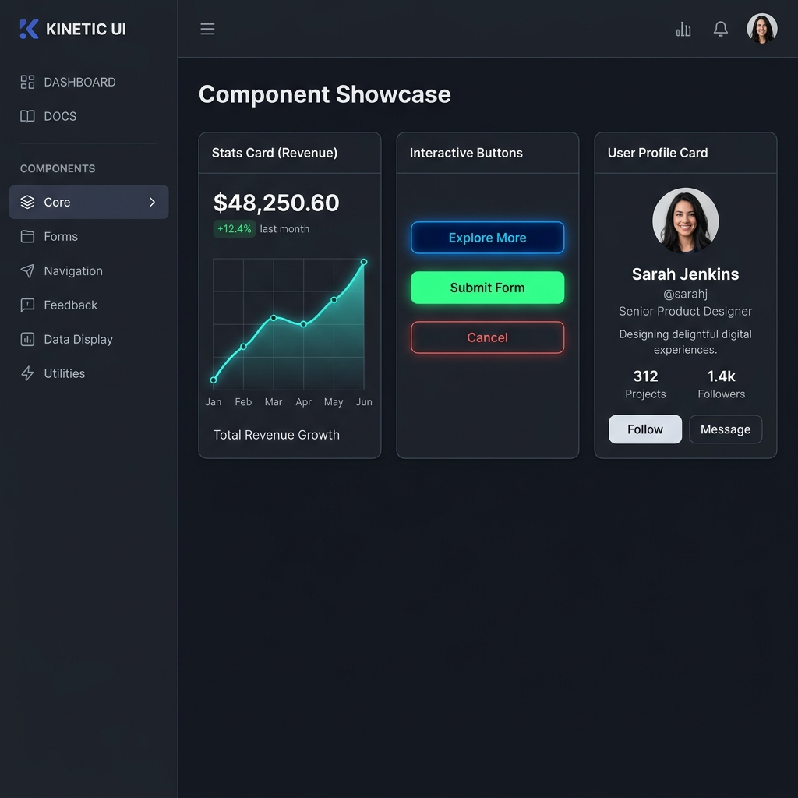

# Wizard Frontend Boilerplate Pro

> **From prompt to production-ready app in one session.**
> Pick a framework, choose a color theme, say the project name — and get a fully
> themed, sidebar-navigated component showcase with light/dark mode, WCAG AA
> contrast, and TypeScript, ready to run.

Covers five frameworks, 13 UI library integrations, 28 components across
6 categories, an OKLCH color palette generator, and full light/dark theming —
out of the box. No blank scaffolds.



## What you get

- **28 UI components** across 6 categories, each with a live example and collapsible code snippet
- **Sidebar showcase** at `/library` with one route per component category
- **OKLCH color palette** — 8 built-in presets or custom hex/OKLCH input, 50–950 scales
- **Light/dark mode** with FOUC prevention and `localStorage` persistence
- **Tailwind v4** (`@theme` directive) with v3 fallback when needed
- **WCAG AA** contrast validation baked into the palette pipeline
- **TypeScript or JavaScript**, any of four package managers

## Supported frameworks

| Framework | Version | Router |
|---|---|---|
| Next.js | 15+ | App Router |
| React + Vite | Latest | React Router v7 |
| Vue | 3.5+ | Vue Router 4 |
| Nuxt | 4 | File-based (built-in) |
| SvelteKit | Svelte 5 | File-based (built-in) |

## Quick start

Invoke the skill from your AI agent. The skill interviews you through five
questions (three values are auto-resolved silently) and then scaffolds the
project end-to-end.

**Claude Code**
```
use the wizard-frontend-boilerplate-pro skill
```

**Cursor / Windsurf / Continue**
```
@wizard-frontend-boilerplate-pro scaffold a new Next.js project
```

**OpenCode**
```bash
opencode skill wizard-frontend-boilerplate-pro
```

**Gemini CLI / Codex / Aider**
```
load SKILL.md from the wizard-frontend-boilerplate-pro skill and follow it
```

## Examples

See [`examples/`](examples/README.md) for three fully documented reference
examples (directory structure, tokens, package list) covering:
- [Next.js + shadcn/ui + Modern Slate](examples/nextjs-shadcn-modern-slate/README.md)
- [Vue 3 + Vuetify + Warm Earth](examples/vue-vuetify-warm-earth/README.md)
- [SvelteKit + DaisyUI + Ocean](examples/sveltekit-daisy-ocean/README.md)

## Example prompts

These prompts launch the skill and pre-answer one or more interview questions:

```
Create a Modern Slate Next.js app with shadcn/ui called "my-dashboard"
```
```
Scaffold a Warm Earth React + Vite project with Chakra UI, TypeScript
```
```
New Vue 3 app — Ocean theme, Vuetify, call it "ocean-admin"
```
```
SvelteKit app with DaisyUI and the Forest color preset
```
```
Build me a Nuxt 4 boilerplate, Royal theme, Element Plus, JavaScript
```

Any answers you include upfront are accepted silently — the skill skips those
questions and asks only what's missing.

## Interview questions

The skill asks five questions, then auto-resolves three values silently:

**Questions (you answer these):**
1. **Framework** — Next.js / React + Vite / Vue 3 / Nuxt 4 / SvelteKit
2. **UI library** — shadcn/ui, MUI, Chakra, Mantine, Ant Design, Vuetify, PrimeVue, Element Plus, HeadlessUI, HeroUI, DaisyUI, Bootstrap, or Custom Tailwind
3. **Language** — TypeScript (default) or JavaScript
4. **Color theme** — pick a preset or supply custom hex/OKLCH values
5. **Project name** — what to call the project directory

**Auto-resolved (never asked):**
- **Package manager** — detected from lock files (bun / pnpm / yarn / npm)
- **Framework version** — always latest stable, queried from the npm registry
- **Tailwind version** — v4 by default; auto-switched to v3 if your UI library requires it

## Color presets

Eight hand-tuned OKLCH palettes, each with a 50–950 neutral scale and an accent scale, all WCAG AA verified. Pick by name or supply your own hex/OKLCH seeds.

| # | Preset | Swatch | Tagline |
|---|---|---|---|
| 1 | **Modern Slate** |   | Clean and confident — the default for professional SaaS |
| 2 | **Warm Earth** |   | Grounded energy — perfect for editorial and content-heavy apps |
| 3 | **Fresh Mint** |   | Light and breathable — natural fit for health, finance, or productivity tools |
| 4 | **Royal** |   | Richness with restraint — great for premium products and creative platforms |
| 5 | **Sunset** |   | Warm energy for marketing sites, landing pages, and social apps |
| 6 | **Ocean** |   | Cool clarity — ideal for developer tools, dashboards, and data-heavy UIs |
| 7 | **Forest** |   | Calm focus for long sessions — well-suited to productivity and note-taking apps |
| 8 | **Monochrome** |  ⬜ | Pure grayscale — lets your content and illustrations be the hero |
| 9 | **Custom** | — | Provide any two hex or `oklch()` seeds for a fully generated palette |

## Component showcase

The `/library` route hosts the full showcase. Home (`/`) redirects there
immediately. The sidebar links to one route per category.

| Category | Route | Components |
|---|---|---|
| Inputs (7) | `/library/inputs` | Button, Input, Textarea, Select, Checkbox, RadioGroup, Switch |
| Display (6) | `/library/display` | Card, Badge, Avatar, Separator, Skeleton, Table |
| Feedback (5) | `/library/feedback` | Alert, Toast, Progress, Tooltip, Dialog |
| Navigation (4) | `/library/navigation` | Tabs, Breadcrumb, Pagination, NavigationMenu |
| Overlay (3) | `/library/overlay` | Popover, DropdownMenu, Sheet |
| Data viz (3) | `/library/data-viz` | Chart, DataTable, Calendar |

Each component block shows a heading, one-sentence description, a live
rendered example, and a `<CodeBlock>` toggle with the example source.

## Pairing with ui-ux-pro-max

When the `ui-ux-pro-max` skill is installed alongside this one, component
output uses that skill's higher-fidelity implementations. If it is not found,
the skill falls back to its own built-in Tailwind-only components automatically
— no configuration needed.

## Workflow phases

| Phase | What happens |
|---|---|
| 1 — Interview | Six questions collect framework, version, language, Tailwind, theme, project name |
| 2 — Version resolution | `check_versions.sh` queries the npm registry; you confirm or override |
| 3 — Scaffold | Framework CLI runs non-interactively; demo files removed; route stubs created |
| 4 — Theming | `generate_palette.py` builds OKLCH scales; `verify_contrast.py` gates WCAG AA |
| 5 — Components | 28 components adapted to the target framework and CSS token system |
| 6 — Showcase | Sidebar layout + 6 category routes installed from templates |
| 7 — Verify | Type check → build → dev server → route walk → theme toggle → contrast gate |

## Directory structure

```
wizard-frontend-boilerplate-pro/
├── SKILL.md                        # Main skill entry point (universal)
├── AGENTS.md                       # One-line alias → SKILL.md
├── workflow.md                     # Detailed playbook with verbatim commands
├── references/
│   ├── frameworks/                 # Per-framework scaffold guides
│   │   ├── nextjs.md
│   │   ├── react-vite.md
│   │   ├── vue.md
│   │   ├── nuxt.md
│   │   └── svelte-kit.md
│   ├── tailwind/
│   │   ├── v4-setup.md
│   │   ├── v3-setup.md
│   │   └── per-framework-gotchas.md
│   ├── ui-library/
│   │   ├── ui-ux-pro-max-bridge.md # Integration contract with sibling skill
│   │   ├── custom-tailwind.md      # Standalone fallback components
│   │   └── framework-adapters/
│   │       ├── react-adapter.md
│   │       ├── vue-adapter.md
│   │       └── svelte-adapter.md
│   ├── theming.md                  # CSS variable tokens, dark mode strategy
│   ├── component-catalog.md        # All 28 components — props, deps, source mapping
│   ├── showcase-layout.md          # Sidebar nav, header, CodeBlock utility
│   └── portability.md              # Notes for non-Claude agents, tested agent list
├── assets/
│   ├── color-presets.json          # Pre-computed OKLCH scales for all 8 presets
│   ├── showcase-templates/
│   │   ├── react/                  # layout, sidebar, 6 category page templates
│   │   ├── vue/                    # AppLayout, Sidebar, 6 page templates
│   │   └── svelte/                 # +layout, 6 route templates
│   └── theme-provider/
│       ├── react.tsx
│       ├── vue.ts
│       └── svelte.ts
├── scripts/
│   ├── check_versions.sh           # Query npm registry for latest stable versions
│   ├── detect_package_manager.sh   # Detect pnpm / yarn / npm / bun
│   ├── generate_palette.py         # Hex/OKLCH → 50–950 OKLCH scale + CSS vars
│   ├── locate_ui_ux_pro_max.sh     # Find sibling skill on disk
│   └── verify_contrast.py          # WCAG AA contrast gate
└── .claude-plugin/
    ├── plugin.json
    └── marketplace.json
```

## Version compatibility

Tested version ranges for each framework and major UI libraries:

| Framework | Tested range | Notes |
|---|---|---|
| Next.js | 15.0 – 15.x | App Router only; Pages Router not supported |
| React | 18.x, 19.x | React 19 fully supported |
| React + Vite | Vite 5.x, 6.x | React Router v7 |
| Vue | 3.5+ | Composition API / `<script setup>` |
| Nuxt | 4.0+ | File-based routing; Nuxt 3 not tested |
| SvelteKit | 2.x | Svelte 5 runes syntax |

| UI Library | Tested version | Framework constraint |
|---|---|---|
| shadcn/ui | latest CLI | React/Next, shadcn-vue, shadcn-svelte |
| Material UI | 6.x | React/Next only |
| Chakra UI | 3.x | React/Next only |
| Mantine | 7.x | React/Next only |
| Ant Design | 5.x | React/Next only |
| HeroUI (NextUI) | 2.x | React/Next only |
| Headless UI | 2.x | React/Next + Vue; not SvelteKit |
| DaisyUI | 4.x | All frameworks (Tailwind plugin) |
| Bootstrap | 5.x | React (`react-bootstrap`), Vue (`bootstrap-vue-next`), Svelte |
| Vuetify | 3.x | Vue/Nuxt only |
| PrimeVue | 4.x | Vue/Nuxt only |
| Element Plus | 2.x | Vue/Nuxt only |
| Tailwind CSS | 4.x (default), 3.x fallback | v3 auto-selected for incompatible combos |

## Requirements

- **Node.js** 18+ (20 LTS or 22 LTS recommended)
- **Python** 3.10+ (stdlib only — no pip installs required)
- **bash** (macOS, Linux, WSL)
- Any AI agent that can read markdown, run shell commands, and write files

## Built with this skill

Have you used this skill to scaffold a project? Open a PR or issue to add your
project here.

| Project | Stack | Link |
|---|---|---|
| *(your project here)* | *(framework + UI library + theme)* | *(GitHub / live URL)* |

## Contributing

See [CONTRIBUTING.md](CONTRIBUTING.md) for how to add a color preset, UI
library, or framework.

## License

MIT — see [LICENSE](./LICENSE).
